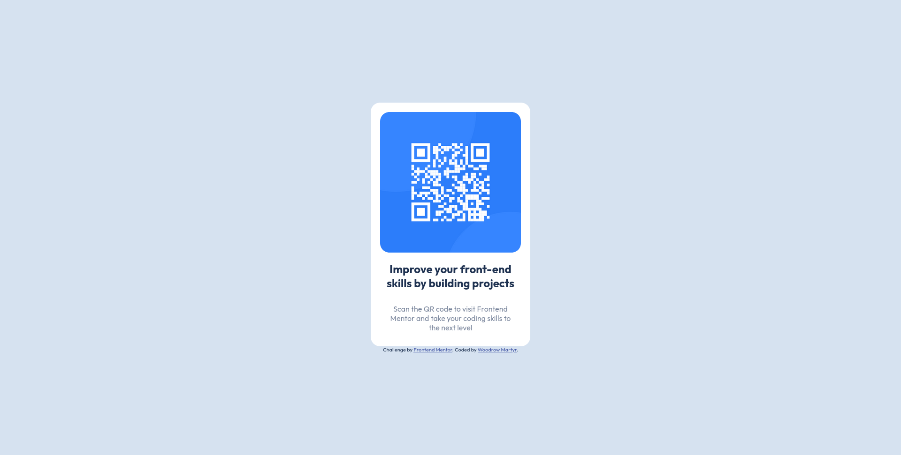

# Frontend Mentor - QR code component solution

This is a solution to the [QR code component challenge on Frontend Mentor](https://www.frontendmentor.io/challenges/qr-code-component-iux_sIO_H). Frontend Mentor challenges help you improve your coding skills by building realistic projects. 

## Table of contents

- [Overview](#overview)
  - [Screenshot](#screenshot)
  - [Links](#links)
- [My process](#my-process)
  - [Built with](#built-with)
  - [What I learned](#what-i-learned)
  - [Continued development](#continued-development)
  - [Useful resources](#useful-resources)
- [Author](#author)

**Note: Delete this note and update the table of contents based on what sections you keep.**

## Overview

### Screenshot

Screenshot of the final page.

### Links

- Solution URL: [https://github.com/wmartyr/qr_code_component](https://github.com/wmartyr/qr_code_component)
- Live Site URL: [https://wmartyr.github.io/
qr_code_component](https://wmartyr.github.io/qr_code_component)

## My process

I first created the html portion and then styled it using CSS with flexbox.

### Built with

- HTML5 markup
- CSS custom properties
- Flexbox

### What I learned

I learned that it takes a few trials of settings to use to get the exact dimensions as the sample. The page I made is still not 100% exactly the same dimensions but I can say that it's only a minor difference.

### Continued development

I'm not 100% sure that this is the best way to do this or it can be refactored more to make the code more efficient.

### Useful resources

- [Example resource 1](https://css-tricks.com/snippets/css/a-guide-to-flexbox/) - This article helped me a lot with flexbox.

## Author

- Website - [Woodrow Martyr](https://github.com/wmartyr)
- Frontend Mentor - [@wmartyr](https://www.frontendmentor.io/profile/wmartyr)

